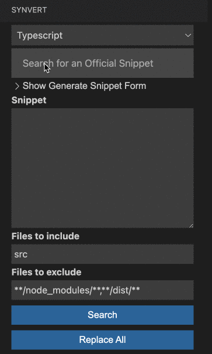
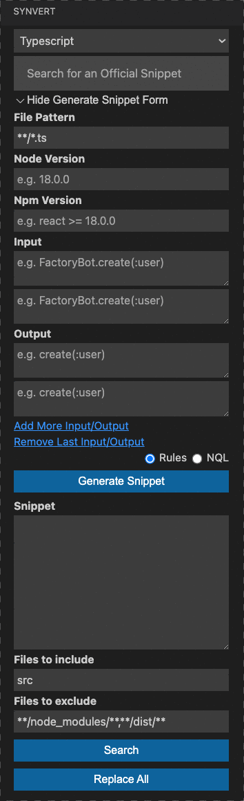
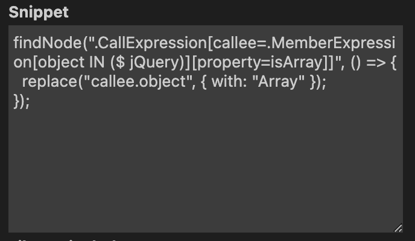

# Synvert README

Synvert vscode extension provides a find / replace alternative based on AST nodes.

Why do you need Synvert?

1. It's more accurate. e.g. it can find parameters in function declaration in typescript but ignore the arguments in function call.

2. It's more powerful. e.g. it can find all unused imports in typescript and remove them.

It supports Typescript, Javascript and Ruby so far.

## Features

- Search and replace. After adding a snippet, you can search the code, and replace all or any of the results.

- Search a snippet. You can search a snippet by group, name or description.

- Generate a snippet. You can generate a snippet by some input codes and output codes.

- Adopt a short snippet. You can write a short snippet without `new Synvert.Rewriter`.

## Requirements

Javascript and typescript are supported by `synvert` npm.

Ruby is supported by `synvert` gem.

## Extension Settings

This extension contributes the following settings:

* `synvert.ruby.enable`: enable/disable synvert ruby, default is true.
* `synvert.ruby.number_of_workers`: number of workers to run synvert ruby, default is 4.
* `synvert.ruby.single_quote`: use single quotes instead of double quotes, default is true.
* `synvert.ruby.tab_width`: specify the number of spaces per indentation-level, default is 2.
* `synvert.javascript.enable`: enable/disable synvert javascript, default is true.
* `synvert.javascript.max_file_size`: skip file if its size is more than the size. (KB), default is 100.
* `synvert.javascript.single_quote`: use single quotes instead of double quotes, default is false.
* `synvert.javascript.semi`: print semicolons at the ends of statements, default is true.
* `synvert.javascript.tab_width`: specify the number of spaces per indentation-level, default is 2.
* `synvert.typescript.enable`: enable/disable synvert typescript, default is true.
* `synvert.typescript.max_file_size`: skip file if its size is more than the size. (KB), default is 100.
* `synvert.typescript.single_quote`: use single quotes instead of double quotes, default is false.
* `synvert.typescript.semi`: print semicolons at the ends of statements, default is true.
* `synvert.typescript.tab_width`: specify the number of spaces per indentation-level, default is 2.

## Key Bindings

* `ctrl+shift+s` / `cmd+shift+s`: open synvert sidebar view.

## Known Issues

Synvert vscode extension searches based on AST nodes, so it's slower than than the traditional find / replace.

But we are still in active development to improve the performance.

**Enjoy!**
